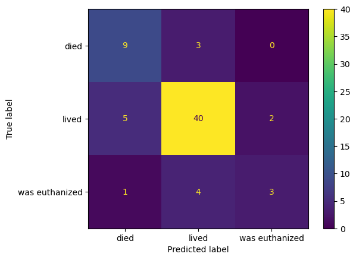
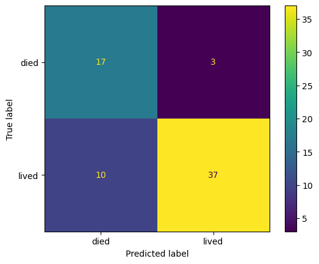

# Kolka u konia

## Najpoważniejsza choroba konia

Kolka u konia to jedna z najpowszechniejszych chorób u konia, która występuję na całym świecie. Choroba ta jest bardzo niebezpieczna - jest jedną z głownych przyczyn zgonów koni.

Zgodnie z raportem Departamentu rolnictwa USA, dla koni w wieku od roku do 20 lat, kolka jest główną przyczyną zgonów odpowiadającą za około 32% wszystkich zgonów.

Podobny raport z 2001 roku wykazał, że co roku na kolke zachoruję 4.2% koni. 1.2% z tych przypadków wymagać będzie operacji a 11 % z nich zakończy się smiercią konia.

## Co to kolka?

Definicja kolki u konia jest bardzo szeroka - jest zdefiniowana jako dowolny ból w jamie brzusznej. Istotnie ból ten nie musi pochodzić z przewodu pokarmowego, ale może z np. wątroby czy nerek.

Objawy kolki można zauważyć zarówno w zachowaniu konia jak i jego parametrach fizycznych. Objawy kolki to przede wszystkim zmniejszony apetyt, zmniejszona częstotliwość wypróżniania, depresja, częste leżenie i rozciąganie się, często spoglądanie na swój brzuch, drapanie się oraz wzdęty brzuch.


Kolka u konia może również objawiać się nieprawidłowymi parametrami fizycznymi. Niektóre prawidłowe wartości podano poniżej.
|Temperatura ciała | Puls | Częstotliwość oddechu | Dziąsła | Częstotliwość wypróżniania |
|--|--|--|--|--|
| 37.3-38.3 ºC | 24-48 bpm | 10-24 na minutę | różowe | 6-10 razy dziennie |

## Zbiór danych

Do badania wykorzystany zostanie zbiór danych UCI o nazwie  Horse Colic Data Set. Zbiór skupia się na parametrach fizycznych koni chorych na kolkę. Charakterystyka zbioru:

 - 368 wierszy, podzielone na zbiór treningowy (300 elementów) i testowy (68 elementów).
 - 28 atrybutów - ciągłe, dyskretne oraz kategoryczne.
 - Dużo brakujących wartości - około 30%. 
 - Data publikacji zbioru danych - rok 1989.

## Cel eksperymentu

Celem eksperymentu jest stworzenie modelu, który na podstawie podanych parametrów określi, czy koń:
 1. Przeżyje
 2. Umrze
 3. Zostanie poddany eutanazji

# Przygotowanie danych

## Wartości brakujące

Zbiór danych wymaga dużo pracy. Zaczniemy od usunięcia części kolumn - tych, które mają dużo brakująych wartości, 
lub których znaczenie jest nie do końca jasne.

Następnie usuniemy jeden wiersz, który ma brakujące wartości w 2 kolumnach - a te kolumny mają tylko 1 brakującą wartość dla tego wiersza.
Dzięki temu stracimy tylko 1 obserwacje, ale pozbędziemy się brakująych wartości w 2 kolumnach.

Na koniec tego kroku uzupełnimy pozostałe brakujące wartości:
- kolumny ze zmnienną ciągłą - brakujące wartości zastąpimy średnią,
- kolumny ze zmienną dyskretną - brakujące wartości zastąpimy modą,
- dla jednej kolumny oznaczonej jako ważna (*abdominal distension*) - brakujące wartości wyestymujemy za pomocą algorytmu k-nearest neighbors.

## Zmienne kategoryczne

W zbiorze danych wszystkie wartości są numeryczne. Nie jest to jednak do końca prawdą, ponieważ zmienne kategoryczne zostały zakodowane liczbowo.

Zaczniemy od podjęcia decyzji, które zmienne kategoryczne będziemy traktować jako nominalne a które jako porządkowe.

Zmienne porządkowe zostawimy zakodowane jako liczby. Jednak kodowanie niektórych z nich nie reprezentuje naturalnego porządku - będziemy musieli to naprawić.

Zmienne nominalne zdekodujemy do reprezentacji tekstowej. W ich przypadku użyte zostaną *dummy variables*, więc reprezentacja tekstowa zwiększy czytelność.

## Kolumny lesion

W zbiorze danych znajdują się 4 kolumny określający lezje (zmiany chorobowe) u konia. Sposób w jaki te kolumny są zakodowane 
jest niedopuszczalny i wymaga przetworzenia.

Kolumny to *surgical lesion?*, *lesion 1*, *lesion 2* oraz *lesion 3*. Najwięcej koni miało 1 lezje lub nie miało jej wcale. W zbiorze
danych jest bardzo mało obserwacji z 2 lub 3 lezjami. W związku z tym te 4 kolumny zostaną przekształcone w 2 nowe kolumny:
- *number of lesions* - całkowita liczba lezji u konia,
- *lesion* - ostatnia lezja u konia (np. dla konia z 2 lezjami będzie to *lesion 2*).

Następnie musimy zakodować kolumne z ostatnią lezją w odpowiedni sposób. Wartości w tej kolumnie są zakodowane jako liczby.
Każda liczba składa się z 4 wartości:
1) miejsce wystąpienia lezji (*site of lesion*), 
2) typ lezji (*type of lesion*), 
3) podtyp lezji (*lesion subtype*),
4) charakterystyczny kod lezji (*lesion specific code*). 

Kodowanie liczbowe jest kodowaniem pozycyjnym, jednak wartości 1 i 4 nie są stałej długości! Mogą mieć one 1 lub 2 cyfry.
Wiekszość wartości ma 5 cyfr - tylko jedna ma ich 6. W przypadku 6 cyfr wszystko jest jasne - 2 pierwsze cyfry to 1), 3 cyfra to 2), 
4 cyfra to 3) oraz 2 ostatnie cyfry to 4).
W przypadku 5 cyfr sytuacja się troche komplikuje. Nasze podejście będzie zakładać, że priorytet ma 1) tj. jeżeli 2 pierwsze cyfry będą
należeć do zbioru wartości 1) (od 00 do 11) to założymy, że określają one 1). W przeciwnym wypadku założymy, że 2 ostatnie cyfry określają 4).

## Kodowanie zmiennych nominalnych oraz skalowanie

Jako przedostatni krok wykonamy kodowanie zmiennych nominalnych jako *dummy variables*. Po tej operacji z 21 kolumn otrzymujemy 56 kolumn.

Na koniec wyskalujemy wszystkie cechy tak, aby ich wartości leżały między 0 a 1. Użyjemy do tego skalowania min-max.

## Ostateczny Pipeline

Jako wynik operacji opisanych w tej sekcji otrzymujemy pipe, który umożliwi nam wykonanie wszystkich tych kroków za pomocą jednej funkcji.
Co więcej ten pipe zostanie użyty do przygotowania danych testowych w fazie ewaluacji.

```
dataTransformationPipe = Pipeline([
    ('column_dropper', columnDropper),
    ('row_dropper', rowDropper),
    ('fill_na', fillNaTransformer),
    ('discrete_encoding', discreteEncodingTransformersPipe),
    ('lesion', lesionPipe),
    ('one_hot', oneHotEncodersTransformer),
    ('scaler', minMaxScalerTransformer)
])
```

# Modelowanie i ewaluacja

## Wybór miary ewaluacji

Jako miare ewaluacji wybierzemy miare F1. Zależy nam na uwzględnieniu precyzji i pełności, więc dokładność odpada.
Rozwiązywany problem to klasyfikacja wieloklasowa, więc należy wykonać pewne operacje aby obliczyć miare F1. 

Typy miary F1 dla klasyfikacji wieloklasowej to min.:
- miara *F1 micro* - wartości TP, FP, TN, FN dla wszystkich klas są sumowane i obliczana jest precyzja, pełność oraz miara F1.
- miara *F1 macro* - dla każdej klasy obliczana jest precyzja, pełność oraz miara F1. Wynikowa miara F1 to z średnia miar F1 dla wszystkich klas.
- miara *F1 weighted* - podobnie jak w macro, jednak uwzględnione są wagi (liczności) dla każdej z klas przy obliczaniu średniej.

Z powyższych miar wybierzemy miare *F1 micro*.

## Wybór klasyfikatora

W tym kroku przetestujemy wiele klasyfikatorów i wybierzemy najlepszy. Klasyfikatory będą walidowane za pomocą walidacji krzyżowej
i dla każdego z nich zostanie obliczony wynik - miara *F1 micro*. Ponadto uwzględnimy takie statystyki jak średnia wartość wyniku, 
najlepszy wynik oraz odchylenie standardowe wyniku.

Hiperparametry każdego z rozważanych klasyfikatorów zostaną wyznaczone przy pomocy GridSearchCV z biblioteki sklearn. 
Przetestujemy następujące klasyfikatory:
- Regresja logistyczna
- Analiza dyskryminacyjna
    - Liniowa analiza dyskryminacyjna
    - Kwadratowa analiza dyskryminacyjna
- Klasyfikator KNN 
- Maszyna wektorów nośnych
    - Linear support vector classifier
    - C-Support Vector classifier
- Drzewo decyzyjne
- Ensemble classifiers
    - Las losowy
    - Bagging classifier
    - Gradient boosting classifier
- Naiwny Bayes
    - Gaussian Naive Bayes
    - Multinomial Naive Bayes

Statystyki klasyfikatorów z walidacji krzyżowej dla najlepszych hiperparametrów, posortowane po średnim wyniku, przedstawiono poniżej:

| No. | Classifier | Best score | Average score | Average std | Best params |
|:----| :--- | :--- | :--- | :--- | :--- |
| 1   | LinearSVC | 0.7260 | 0.7099 | 0.0473 | {'C': 2, 'dual': False} |
| 2   | BaggingClassifier | 0.7224 | 0.7074 | 0.0308 | {'n\_estimators': 20} |
| 3   | RandomForestClassifier | 0.7324 | 0.6994 | 0.0283 | {'ccp\_alpha': 0.002210917811940833, 'n\_estimators': 100} |
| 4   | LogisticRegression | 0.7025 | 0.6991 | 0.0233 | {'C': 1.1} |
| 5   | LinearDiscriminantAnalysis | 0.6889 | 0.6790 | 0.0347 | {'shrinkage': 'auto', 'solver': 'lsqr'} |
| 6   | MultinomialNB | 0.6888 | 0.6759 | 0.0467 | {'alpha': 1.1} |
| 7   | GradientBoostingClassifier | 0.7293 | 0.6748 | 0.0173 | {'ccp\_alpha': 0.0, 'n\_estimators': 100} |
| 8   | DecisionTreeClassifier | 0.6925 | 0.6733 | 0.0383 | {'ccp\_alpha': 0.007943143812709028} |
| 9   | KNeighborsClassifier | 0.6921 | 0.6703 | 0.0340 | {'n\_neighbors': 20, 'p': 2, 'weights': 'uniform'} |
| 10  | QuadraticDiscriminantAnalysis | 0.6856 | 0.6644 | 0.0279 | {'reg\_param': 0.1} |
| 11  | SVC | 0.7123 | 0.6558 | 0.0274 | {'C': 2, 'degree': 2, 'gamma': 'scale', 'kernel': 'rbf'} |
| 12  | GaussianNB | 0.6687 | 0.5868 | 0.0783 | {'var\_smoothing': 1} |

Powyższe dane zostały naniesione na wykres. Na wykresie wysokość słupka oznacza średni wynik. Ponadto zaznaczone zostało
średnie odchylenie standardowe.


Jak widać 4 modele są wyraźnie lepsze od innych. Jako nasz ostateczny model wybierzemy **RandomForestClassifier** (las losowy),
ponieważ sposród 4 rozważanych ma 3 najlepszy średni wynik, najlepszy najlepszy wynik oraz 2 najlepsze średnie odchylenie standardowe.

## Analiza wybranego klasyfikatora

Teraz przeanalizujemy wybrany klasyfikator pod kątem ważności cech. Jednak zanim to zrobimy musimy zdekodować zmienne
zakodowane za pomocą *dummies*. Jako wynik dla takich grup cech weźmiemy maksymalny wynik dla elementu z grupy. Ważność
cech dla klasyfikatora *RandomForestClassifier* została przedstawiona na wykresie poniżej:


## Ewaluacja

Dane testowe zostały wczytane z oddzielnego pliku i przetworzone za pomocą wytrenowanego wcześniej pipe'a. 

Uzyskany wynik *F1 micro* dla danych testowych wynosi **0.7761**, a więc zgodnie z założeniem jest lepszy od wyniku walidacji krzyżowej.

Macierz omyłek dla predykcji zbioru testowego została przedstawiona poniżej:



# Bonus - klasyfikacja binarna 
Jako bonus uprościmy zadanie do klasyfikacji binarnej, tak aby stworzyć model przewidujący czy koń umrze czy przeżyje.

Zaczniemy od zamienienia wartości *was euthanized* na *died* w kolumnie *outcome* - w tym celu skonstruujemy transformator.
Następnie stworzymy nowy pipe z utworzonym transformatorem na końcu.

Następnie wytrenujemy ten sam (z takimi samymi hiperparametrami) klasyfikator *RandomForestClassifier*. Po przetestowaniu
modelu na zbiorze testowym otrzymujemy wynik **0.806**, który jest troche lepszy niż wynik dla klasyfikacji wieloklasowej.

Macierz omyłek dla klasyfikacji binarnej została przedstawiona poniżej:



# Żródła

- [Colic in Horses - University of Florida](https://edis.ifas.ufl.edu/publication/VM139)
- [Horse Colic Data Set - UCI](https://archive.ics.uci.edu/ml/datasets/Horse+Colic)
- [September: Impaction Colic](https://swiftsureequine.com/september-impaction-colic/)
